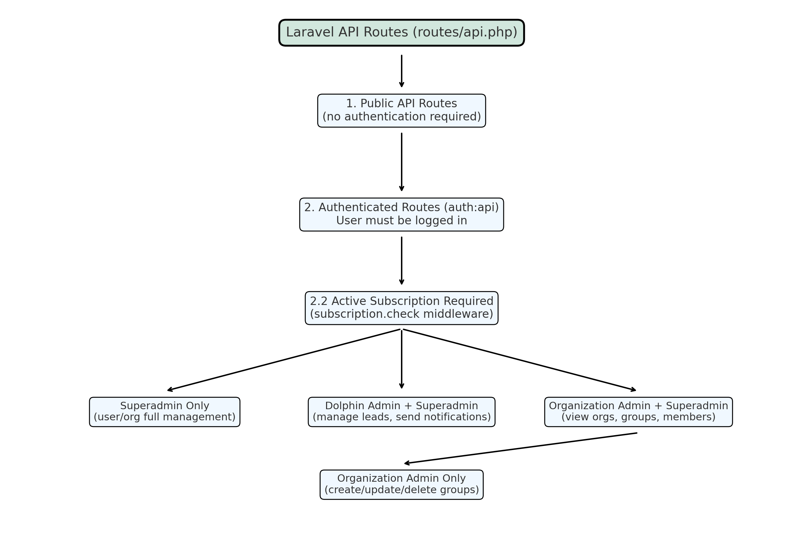

# Dolphin Backend

This directory contains the Laravel-based backend for the Dolphin application. It serves as a RESTful API for the Vue.js frontend, handling data persistence, business logic, and user authentication.

## Tech Stack

-   **Framework**: Laravel
-   **Authentication**: Laravel Passport
-   **Database**: MySQL, SQLite (for testing/development)
-   **Queue System**: Laravel Queues for background jobs (e.g., sending notifications)

## API Endpoints

The primary API routes are defined in `routes/api.php`. This file includes routes for:

-   Authentication (register, login)
-   User and Organization Management
-   Assessments
-   Leads
-   Notifications
-   Stripe Webhooks (`routes/stripe_webhook.php`)

## Getting Started

### 1. Prerequisites

-   PHP >= 8.1
-   Composer
-   A configured database (e.g., MySQL)

### 2. Installation

From within the `Dolphin_Backend` directory:

```bash
# Install PHP dependencies
composer install

# Create the environment file
cp .env.example .env

# Generate a unique application key
php artisan key:generate
```

### 3. Environment Configuration

Open the `.env` file and configure your database connection and other environment-specific settings.

```ini
DB_CONNECTION=mysql
DB_HOST=127.0.0.1
DB_PORT=3306
DB_DATABASE=dolphin
DB_USERNAME=your_db_user
DB_PASSWORD=your_db_password

# Set the frontend URL for CORS and email links
FRONTEND_URL=http://127.0.0.1:8080
```

### 4. Database and Authentication

```bash
# Run database migrations to create the necessary tables
php artisan migrate

# Set up Laravel Passport for API authentication
php artisan passport:install
```

### 5. Running the Server

```bash
# Start the local development server
php artisan serve
```

The API will be available at `http://localhost:8000`.

## Background Jobs

The application uses Laravel's queue system to handle long-running tasks like sending scheduled notifications. To process these jobs, you need to run the queue worker:

```bash
# Process jobs on the default queue
php artisan queue:work
```

For scheduled tasks, ensure the Laravel scheduler is running. This is typically done via a cron job on a production server. For local development, you can run:

```bash
# Run scheduled tasks
php artisan schedule:work
```

## Testing

To run the test suite (both unit and feature tests):

```bash
php artisan test
```

## Key Directories

-   `app/Http/Controllers`: Contains the controllers that handle API requests.
-   `app/Models`: Defines the Eloquent models for database interaction.
-   `app/Jobs`: Houses the jobs that are dispatched to the queue.
-   `app/Notifications`: Contains notification classes.
-   `database/migrations`: Stores the database schema migrations.
-   `routes/`: Contains all route definitions.
-   `tests/`: Home for all feature and unit tests.

